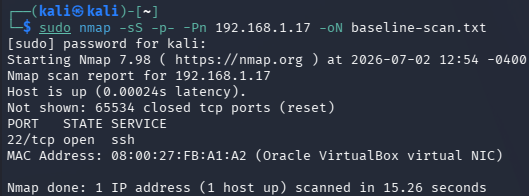
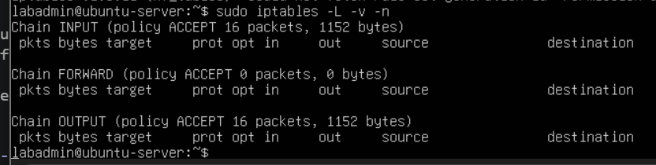
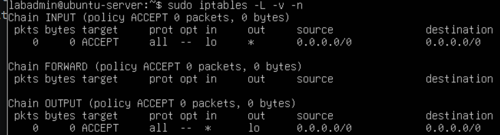
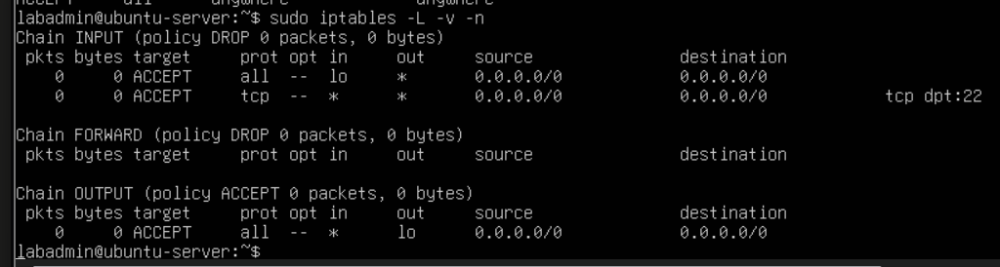
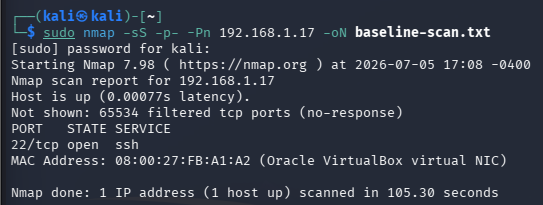

# Project 2: Firewall Lab (iptables + nmap Before/After)
This lab project delves deeper into firewall configuration with the use of **iptables**, the firewall configuration software for Linux. This project aims to secure the network traffic that comes in and out of the Ubuntu Server VM. Kali Linux, will be used to simulate a port scan using the network mapping tool (nmap). This project serves as a great way to develop proficiency in the port scanning technique as well as fundamental firewall configuration skills. It is important to note that iptables is a legacy tool, and that nftables has now replaced the entire iptables ecosystem. 

## Purpose
- Showcase the use of nmap in scanning open and closed ports of a device
- Showcase firewall configuration proficiency using iptables
- Develop cybersecurity knowledge of port scanning
- Develop networking knowledge of firewall techniques and standard practices
- Develop linux command line proficiency through using Ubuntu Server and Kali Linux


## Software/Tools Used
Kali Linux:
- nmap

Ubuntu Server:
- iptables
- iptables persistent

## Baseline NMAP Scan (Before)

From the Kali Linux machine, use this command to conduct an nmap scan on the Ubuntu Server. This result will serve as a baseline to see how the Ubuntu machine responds differently after configuring the firewall. 
```bash
sudo nmap -sS -p- -Pn 192.168.1.17 -oN baseline-scan.txt
# -sS for SYN scan only. Does not complete the TCP three way handshake
# -p- prompts nmap to scan for ALL 65,535 TCP ports
# -Pn skips the ping check and scans the host without reliance on host pings
# -oN writes results as a human-readable file to specified file
```

Result:



## iptables install and configuration

In our previous lab, SSH Hardening, ufw was used instead of iptables. Essentially, both are used to write firewall rules into netfilter, which is the actual kernel-level framework for network packet manipulation. Although both ufw and iptables are used to configure firewall rules, there is a key difference. Ufw is a high-level cli frontend that uses iptables, while iptables is a low-level cli frontend that directly talks to netfilter. Both cannot be used at the same time otherwise, conflicts may arise. As such, if ufw is currently being used, it must be disabled or uninstalled. 
```bash
# disable it
sudo ufw disable
# or uninstall it
sudo apt remove ufw
```
Now, we must install iptables-persistent
```bash
sudo apt update
sudo apt install iptables iptables-persistent
```

```bash
sudo iptables -L -v -n
```


## Firewall Configuration using iptables
For iptables, the filter table is responsible for managing and filtering packets. It is used to allow and block decisions based on three chains: 
- INPUT chain: manages packets incoming
- OUTPUT chain: manages packets outgoing
- FORWARD chain: manages packets passing through host to some other location

Targets are used to determine the outcome of a packet that matches a rule created:
- ACCEPT : lets the packet through
- DROP : silently discards the packet with no reply to the source
- REJECT: discards the packet and sends an error reply to the source


### Loopback Traffic
Loopback traffic is defined as network traffic or data that a device sends to itself. A lot of applications generate loopback traffic and if not properly configured to pass through the firewall, it may break applications and complications may occur. 

```bash
sudo iptables -A INPUT -i lo -j ACCEPT # -i lo matches the input interface as the loopback interface
sudo iptables -A OUTPUT -o lo -j ACCEPT # -o lo matches the output interface as the loopback interface
```


### Enable port 22

```bash
sudo iptables -A INPUT -p tcp --dport 22 -j ACCEPT
# -p : used to set protocol
# --dport : used to set port
# -j : used to set target
```
### Default Deny
The default deny concept was tackled in the SSH hardening project briefly. Essentially, concept of a default deny is to deny or block all traffic by default unless explicitly stated or configured to allow it to pass through. This ensures that there are no rogue or forgotten open ports that could be a vulnerability to the server or system. The most common configuration for a default deny is a: INPUT - DROP, FORWARD - DROP, OUTPUT - ACCEPT. 
```bash
sudo iptables -P INPUT DROP 
sudo iptables -P FORWARD DROP
sudo iptables -P OUTPUT ACCEPT
# -P is used to set a default policy
```
The reason why INPUT and FORWARD are set to DROP instead of REJECT is to prevent the server/system from providing a response to potential threat actors. If nmap were to be used to scan for open ports in the Ubuntu VM, a REJECT target would send an error message out, essentially allowing itself to be known. A DROP target would have no response and just disregard the packet, essentially hiding from the port scan. 

The final firewall chain table is shown here:



### Save changes
To save the changes and keep the firewall configuration persistent through system restarts, the iptables persistent package would be used for this exact purpose.
```bash
sudo netfilter-persistent save
```


## NMAP scan (after)
```bash
sudo nmap -sS -p- -Pn 192.168.1.17 -oN after-scan.txt
```
Result:


After configuring the firewall with a default deny policy in mind, after an nmap scan of all ports of the ubuntu server, port 22 is the only port confirmed to be open while the other ports are not shown or filtered which is the result of the default drop for the INPUT chain. This is a key difference since the previous nmap scan ascertained that all other ports were closed which could be the difference between the threat actor breaching the system through other ports or not. 

## Conclusion
This project has similarities to the SSH-hardening project with the main difference being the focus. This project focuses on developing firewall configuration proficiencies instead of locking down SSH server connections which only includes a portion of firewall control. The iptables command-line utility was used to configure firewall rules, and nmap tool was used to scan ports. A before and after with results and evidence were provided showing that the firewall indeed hid all the other closed ports from the port scan. Only the open port (port 22) was seen. This is relevant in hiding servers from port scanning attacks. A summary of proficiencies developed are as follows:

- Further developed firewall configuration skill (using iptables) by exploring concepts of firewall rule chains and targets
- Further honed linux familiarity through the use of the Ubuntu Server and Kali Linux distros.
- Developed cybersecurity concepts:
    - Attack surfaces
    - Port scanning
- Developed networking concepts through firewall familiarity and the default deny concept. 
## Next Step

The next step from here is to move from prevention to detection. The following lab will involve attacking this same hardened Ubuntu server from Kali and then reconstructing the attack purely from logs (`journalctl`, `auth.log`, and the fail2ban log), without having watched it happen live. This will test whether the current firewall and logging setup actually surface an intrusion attempt, not just block it.