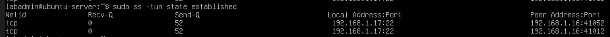
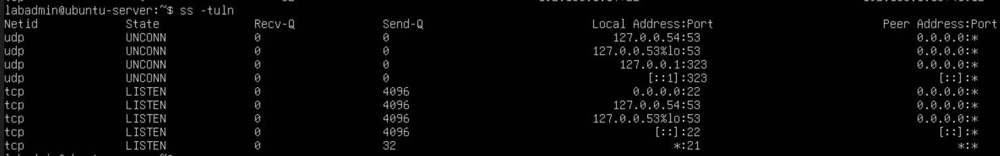
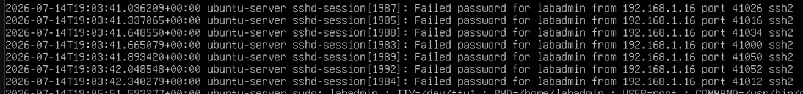
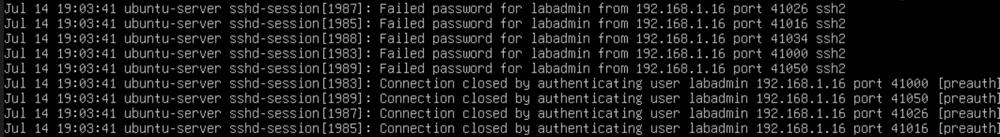
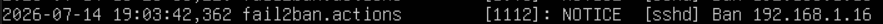
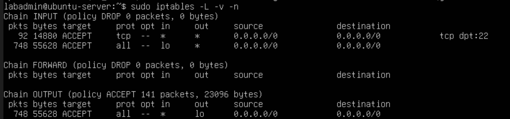

# Lab 3: Attack Detection and Log Reconstruction
## Overview
In previous labs (1 and 2), the focus was on server reinforcement and attack surface reduction & prevention. Configuring the firewall rules, locking down the open port 22, these are ways to prevent attacks. However, what if an attack was still conducted? How would we be able to detect it. Lab 3 shifts the perspective from prevention to detection. In this lab, we will focus on reconstructing the attack timeline purely based on logs and monitoring tools/software. Logs are one of the most fundamental tool of a cybersecurity personnel, it allows them to record and monitor events. Log-based reconstruction leans more towards digital forensics and incident response, essentially trying to reconstruct a sequence of events from various monitoring softwares or logs. 
## Software/Tools/Util Used
| Software/Tool/Util| Reason|
|-------------------|-------|
|hydra (in attacker's device)| This is used to conduct a brute-force attack (also used in lab 1) on the Ubuntu Server.|
|ss (socket statistics)|A utility used to monitor network connections, ports, and routes. This serves as the first layer for detecting an attack. |
|journalctl|A utility used to specifically query and filter systemd logs. This is used to check for auth.log (authentication-related event log)|
|fail2ban|An intrusion prevention framework to monitor system logs, set auth limits, and outright ban malicious IP addresses|

## Prerequisite
In lab 1, we already disabled password authentication and have switched to key-pair authentication which is more secure and almost impossible to hack or brute-force. However for this lab, we would need to enable password authentication once more to simulate a brute-force attack that we would piece together from logs alone. Previously, fail2ban was setup to have a maximum password auth attempt of 5 before getting flagged and getting banned. For this, see lab 1 for more information how to setup.

## Bruteforce attack using hydra (Attacker Side)
```zsh
hydra -l labadmin -P passwordlist.txt ssh://192.168.1.17
```
Kali linux is use to run hydra to conduct a brute-force attack. Note that the passwordlist.txt should not the correct password for the user (in our case, labadmin).

## Network evidence check
```bash
ss -tun state established
# -t shows TCP sockets
# -u shows UDP sockets
# -n resolves IPs as numeric output and not hostnames or service names
# state established filters only for sockets in ESTAB state
```


Take note of the peer address that is connected (192.168.1.16), we shall investigate with this IP in mind.
```bash
ss -tuln
#-t, -u, -n same as above
# -l shows only listening sockets
```

This command shows us the status of currently running services are bound and listening. In this context, it is used to check for the attack surface. Based on this,excluding loopback traffic, port 21 and 22 are currently listening. However in our previous lab, we configured our firewall for a default deny (default drop), allowing only port 22 to be open. This could mean that port 21 is reserved but not reachable by network traffic outside. Hence we must continue investigating port 22, where the real vulnerability is unathorised user login attempts. To know for sure, we proceed to the next layer of reconstruction, checking auth.log/journalctl.
## Log evidence check
```bash
sudo grep -aiE "failed password|authentication failure|invalid user" /var/log/auth.log
# grep is a search utility
# -a is to read byte files as text files, -i is to read with as case insentive, -E uses ERE
# format: grep "keyword" file
```


The command above was used to check specifically for failed login attempts using the auth.log in hopes to shed light on a possible attack. Note the time between each failed password, not even a second has passed. This is a good indicator that this is a brute-force login attack.
```bash
sudo journalctl -u ssh --since "1 hour ago"
# format: journalctl -u SERVICE
# --since "time" to filter based on time
```


This command, although looks similar, searched for all the logs in the ssh service within an hour. The evidence above is a cropped image of a long list of logs, and it coincides with the findings in auth.log. Which confirms a brute-force attack from the ip 192.168.1.16, the same IP found in the socket statistic (ss) search. After confirming an attack, the next thing must be to stop the threat actor, in this case, banning it. Since we already have a fail2ban login attempt limit, we should check if the ban went through.

## Response evidence check
```bash
sudo grep "Ban" /var/log/fail2ban.log
```


grep is used here to search in fail2ban.log, searching for the keyword "ban". We can clearly see the ip was banned shortly after the attack. From here on, we can now construct the full timeline and correlate what possibly happened. Taking note of all the timestamps scattered over logs from various utilities/softwares.

```bash
sudo iptables -l -v -n
```


A recheck of the current firewall configuration was done to ensure that it was not tampered with. 
## Reconstructed Attack Timeline
An unusual ip address, 192.168.1.16, was found in a socket statistics (ss) query. Based on further investigation, between 19:03:41.036209 and 19:03:42.340279 of July 14, 2026, the ip 192.168.1.16 made 6 password authentication attempts against the sudo user labadmin. The cadence between each attempt was around 300ms, seen in auth.log and journalctl. Fail2ban was able to ban the ip at time 19:03.42362 on the same day. After reviewing the iptables, the firewall has not been tampered with and still drops any other connection other than port 22. No login attempt went through, labadmin has not been breached.
## Conclusion
In this lab, I learned more about threat detection and reaction. This lab simulates a brute-force attack on the Ubuntu Server where measures are already put in place (fail2ban). A reconstruction of the attack timeline based on logged data and guided inference was made. Overall, I gained key competencies:

### Proficiencies Gained
- Strengthened defensive security proficiency 
- Further developed my network and firewall understanding
- Improved my linux proficiency from pure command-line navigation
- Developed familiarity with linux utilities (ss, auth.log, grep, journalctl) as well as fail2ban

## Next step
The final step of this entire project is to delve deeper and read raw network traffic and capture actual packets through the use of tcpdump and Wireshark.