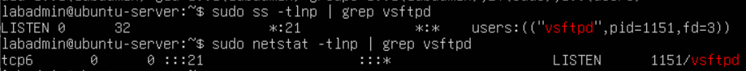
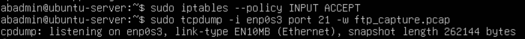
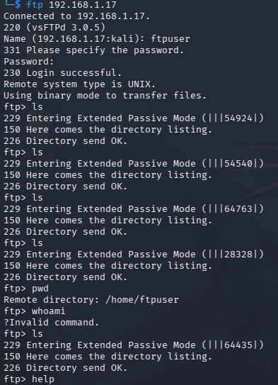
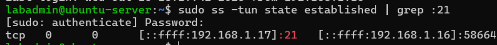
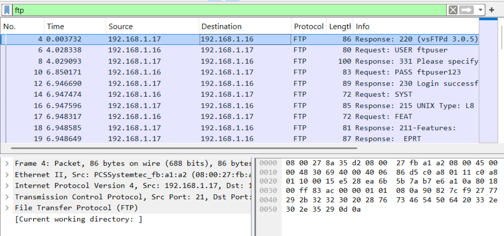
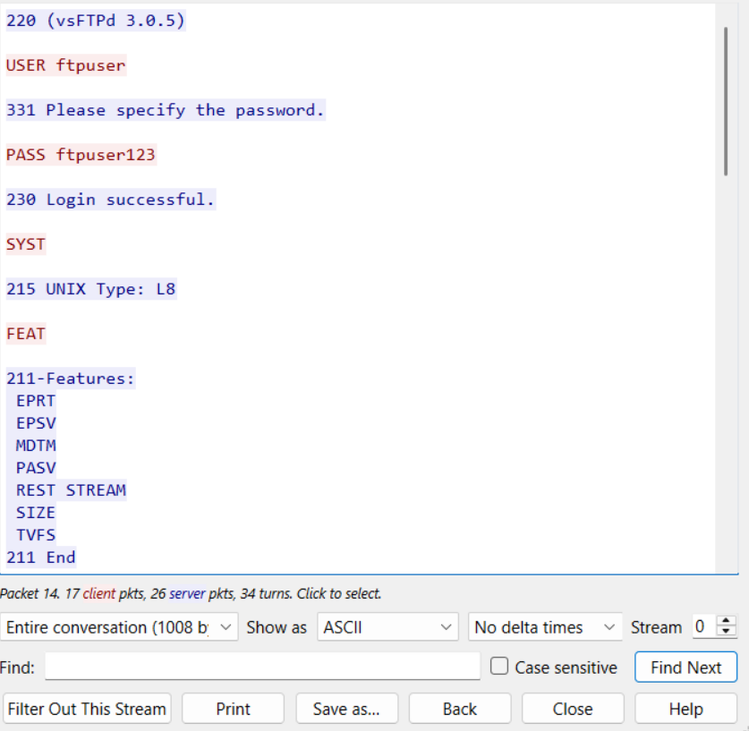
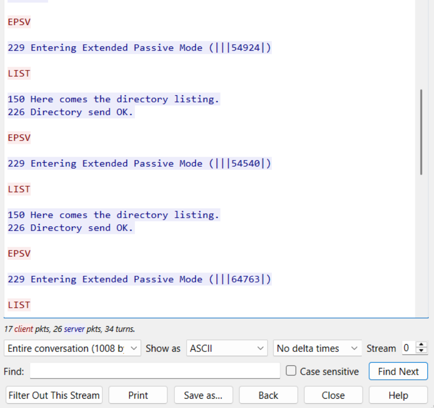
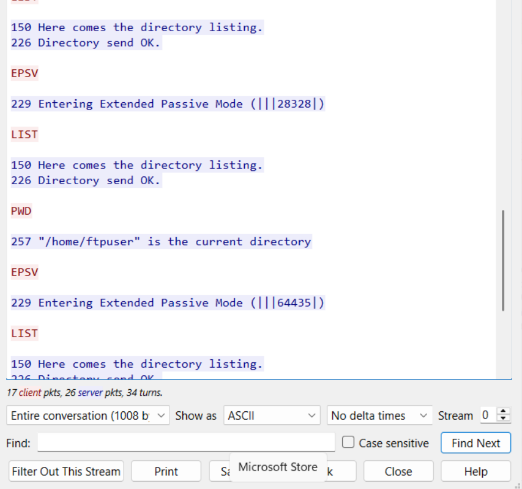
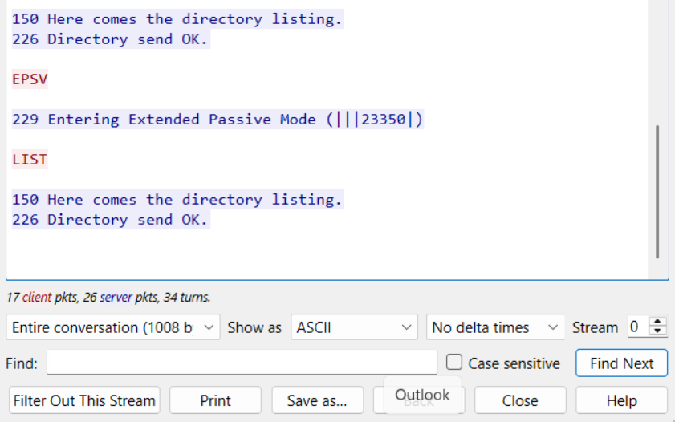

# Lab 4: Packet Capture & Traffic Analysis (using netstat/ss, tcpdump, and wireshark)
## Overview
This is the final lab of the portfolio project and shifts focus from logs to raw network traffic itself. Lab 3 reconstructed an attack from logs alone; this lab goes one level deeper by capturing actual packets off the wire with tcpdump and inspecting them with Wireshark. Using an FTP session as the example, this lab shows how an unencrypted protocol exposes credentials and commands to anyone capturing traffic on the network.
## Software/Tools/Util Used

| Software/Tool/Util| Reason|
|-------------------|-------|
|vsftpd|An open source ftp user that is commonly used in linux-based servers for file sharing/transfer.|
|ss (socket statistics)|A utility used to monitor network connections, ports, and routes. This serves as the first layer for detecting an attack.|
|tcpdump|A command line packet analyzer tool that is used to intercept and log network traffic. |
|wireshark|An open source GUI network protocol analyzer more suited for deep packet inspection. |

## Prerequisite
Before we proceed with the project, all the necessary software/tools must already be installed. The ss command-util was already pre-installed on my ubuntu server, and I installed tcpdump on it separately.

```bash

sudo apt install ss #if ss not installed
sudo systemctl status ss

sudo apt install vsftpd #if vsftpd not installed
sudo systemctl status vsftpd

sudo ss -tlnp | grep vsftpd # check if vsftpd socket is listening
sudo netstat -tlnp | grep vsftpd # same check, using netstat instead

```


Both commands confirm vsftpd is listening on port 21, which is the socket-level check needed before capturing any traffic.

Afterwards, I installed Wireshark on a separate windows machine by searching it up on a web browser and installing it.

## Setup
The general setup is as follows, I use a remote machine (Kali Linux: 192.168.1.16) and used the file transfer protocol to do non-instrusive commands such as ls, and pwd. While that is ongoing, we will use tcpdump to capture network traffic and record the network packets to store it in a file. Afterwards, we send that file to the windows machine (192.168.1.15) for further analysis. 

I created another ubuntu user for this lab, however this is only an optional step. 
```bash
sudo adduser ftpuser
```

## Activate packet sniffing tool
```bash
sudo iptables --policy INPUT ACCEPT
sudo tcpdump -i enp0s3 port 21 -w ftp_capture.pcap
```


tcpdump is started on the Ubuntu server, listening on interface enp0s3 for traffic on port 21, and writing everything it sees to `ftp_capture.pcap`. This runs in the background while the FTP session below takes place.

## File Transfer Protocol
I used the file transfer protocol on my kali linux (192.168.1.16) to talk to my ubuntu machine (192.168.1.17)

```bash
ftp 192.168.1.17
ftp> ls
ftp> pwd
ftp> exit
```


Login succeeded as ftpuser, and a few non-destructive commands (ls, pwd) were run to generate traffic for tcpdump to capture. `whoami` was also tried and correctly rejected, since it's a shell command and not a valid FTP command.

## Check socket statistics for port confirmation
```bash
sudo ss -tun state established | grep :21
```


This confirms the FTP session from 192.168.1.16 is actually established on port 21, the same connection tcpdump is capturing.

## Wireshark analysis
After the capture, `ftp_capture.pcap` was moved to the Windows machine and opened in Wireshark. Filtering on `ftp` isolates just the FTP control-channel packets.



Following the TCP stream shows the entire session in plaintext, starting with the login: `USER ftpuser` immediately followed by `PASS ftpuser123`, both fully readable.



The rest of the stream shows each `ls` command triggering an `EPSV`/`LIST` exchange between client and server.



The `pwd` command is also visible in cleartext, along with the server confirming the working directory.



The final part of the stream shows the last `ls` call before the capture ended.



This confirms FTP sends everything, including login credentials, unencrypted. Anyone capturing traffic on the same network can recover the username and password directly from the packets.

## Conclusion
This lab wraps up portfolio project 1, as a fundamental cybersecurity homelab focused on basic prevention, detection, and finally inspection. Socket statistics (ss) was used to confirm the connection, tcpdump was used to capture and intercept the packets, and Wireshark was used to reveal the data itself from the packets showing that without proper encryption, login credentials and other sensitive information are laid bare, out in the open for anyone to capture and inspect. This lab shows the importance of encryption at a network packet level and how encrypted alternatives could be used such as SFTP.

## Proficiencies Gained
- Learned to capture live network traffic with tcpdump and save it for offline analysis
- Learned to filter and follow TCP streams in Wireshark for deep packet inspection
- Reinforced how ss/netstat serve as a first, lightweight layer of network visibility before deeper packet-level analysis
- Gained a practical understanding of why unencrypted protocols like FTP are considered insecure

## Next Steps
The next project could focus on building proficiency in tools such as active directories (AD), security information and event managemnent (SIEM), and both intrusion detection systems & intrusion prevention systems (IDS & IPS).