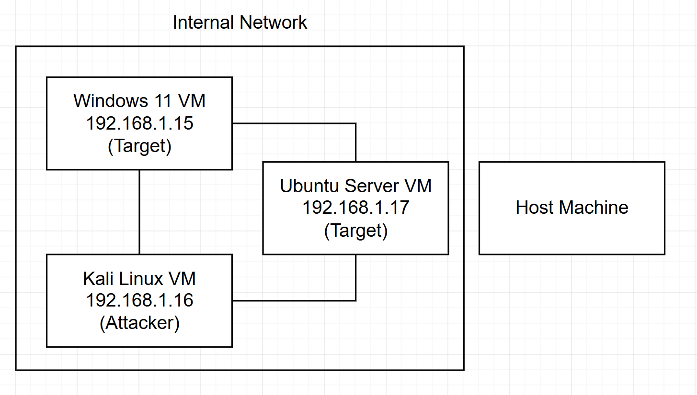
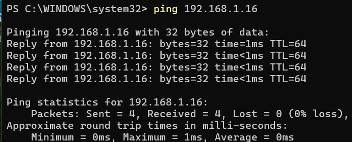

# Penetration Testing HomeLab Setup

This is a fundamental homelab setup built using **VirtualBox** that manages three virtual machines: **Windows 11**, **Kali Linux**, and **Ubuntu Server**. The VMs can communicate with each other and are connected using an internal network configuration, isolated from the host device itself and the home network. This setup ensures a secure, safe, and a self-contained environment for experimentation, and security testing towards gaining hands-on experience in red and blue teaming. 

## Overview
This lab demonstrates key cybersecurity concepts and networking fundamentals. An internal network setup isolates the virtual machines in their own network without access to the internet nor the host device. This lab sets up an attacker machine (Kali Linux VM) or the threat actor, and the target machines (Windows VM and Ubuntu Server VM). This builds the foundation of future penetration testing experiments. Network isolation, static IP configuration, cross-platform networking, and cybersecurity lab safety were all demonstrated.


## Environment
| Component        | Details                           |
|------------------|-----------------------------------|
| Hypervisor       | VirtualBox                        |
| VM 1             | Windows 11                        |
| VM 2             | Kali Linux                        |
| VM 3             | Ubuntu Server                     |
| Network mode     | Internal Network (`homelabnet`)   |
| Addressing       | Static IPv4, 192.168.1.0/24 subnet|
Technical & project questions

Tell me about a project you've worked on. Walk me through the technical details, your specific role, and the outcome. (This is explicitly flagged — expect them to drill deep, so pick a project you can defend end-to-end.)
Tell me about a technology you're familiar with. What do you know about it, and how have you used it? (Be ready to go in-depth — they're testing whether you actually understand it rather than name-dropping.)
Tell me about a time you had to troubleshoot a difficult technical problem. How did you diagnose it and what was your process? (Verkada's product is networked hardware — cameras, access control, sensors — so networking fundamentals like IP addressing, DNS, DHCP, PoE, VLANs, and firewalls are very likely to surface here.)
What technology or area are you most excited to learn about? (Directly tied to their "interest in technology" evaluation criterion — shows curiosity and growth mindset.)
How would you explain a complex technical concept to a non-technical customer? (Core to a support engineering role — tests communication and empathy.)

Behavioral questions (mapped to their stated values)

Ownership: Tell me about a time you took full responsibility for a problem or saw something through when it would have been easier to pass it off.
Teamwork: Tell me about a time you worked with a team to solve a problem, or had to resolve a disagreement with a teammate.
Initiative: Tell me about a time you went beyond what was asked of you, or identified and fixed a problem no one told you to.
Customer-facing / motivation: Tell me about a time you dealt with a frustrated or difficult customer (or stakeholder). How did you handle it? (Ties to the customer-facing experience and attitude focus.)
Why Verkada, and why technical support specifically? What motivates you about this kind of work? (Third-round manager screens almost always probe genuine motivation and fit.)
## Network Architecture


## Setup and Network Configuration

### 1. Prerequisites   
- Install VirtualBox
- Download Windows 11 iso file
- Download Kali Linux iso file
- Download Ubuntu Server iso file

### 2. OS Installation
In VirtualBox, for each VM:
- Select New VM
- Set VM name, ISO image, specify resources allocation, then finish

For Windows:
- RAM: 2 GB
- CPU cores: 2
- Storage: 60 GB
- Video MEM: 128 MB

For Kali Linux: 
- RAM: 4 GB
- CPU cores: 4
- Storage: 80 GB
- Video MEM: 128 MB

For Ubuntu Server:
- RAM: 2 GB
- CPU cores: 2
- Storage: 25 GB

*resource allocations may be changed*

### 3. Network Config
For each VM:
Go to Settings > Network > Adapter 1
- Enable Network Adapter
- Change the network mode to **Internal Network**
- Rename network name
- Apply changes

### 4. Assign Static IP

**Windows:** Settings > Network and Internet > Ethernet > config: manual, IP assignment: 192.168.1.15, subnet mask: 255.255.255.0

**Kali Linux:** ethernet > edit connections > wired connection > settings > IPv4 settings > set method to manual > add address: IP: 192.168.1.16, netmask: 24

**Ubuntu Server:** Static IP is assigned by editing the Netplan configuration file:
```bash
sudo nano /etc/netplan/00-installer-config.yaml
```
Set the configuration:
```yaml
network:
  version: 2
  ethernets:
    enp0s3:
      dhcp4: false
      dhcp6: false
      addresses:
        - 192.168.1.17/24
```
Apply the changes:
```bash
sudo netplan apply
```
No gateway or DNS is required as the internal network has no internet access.

### 5. Ping Test
In order to check if all virtual machines are indeed in the same internal network and have been configured properly, we must conduct a ping test.

In the Windows 11 VM PowerShell terminal:
```powershell
ping 192.168.1.16
ping 192.168.1.17
```

Expected output:



**add result here**

## Next Steps
The next steps for this homelab is to harden the Ubuntu Server VM and prove the lockdown works. This involves creating a non-root sudo user, configuring key-only SSH authentication, setting up a default-deny firewall using `ufw`, and deploying `fail2ban` to detect and block brute-force attacks. The hardening will be verified by attacking the Ubuntu Server from Kali using `hydra` and confirming the ban across three independent log sources.

## Developed Proficiencies
- Applied network segmentation principles and configured an isolated internal network in VirtualBox
- Configured manual IP addresses across Windows, Kali Linux, and Ubuntu Server
- Configured permanent static IP on Ubuntu Server using Netplan
- Conducted a cross-platform connectivity check using the ping command (ICMP) between all three VMs
- Developed Linux proficiency through exposure of linux distros and CLI usage
