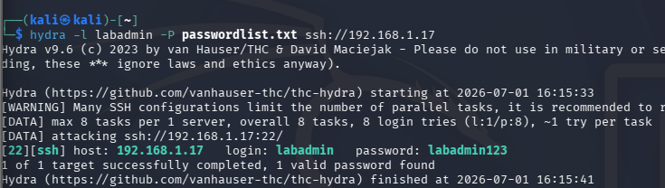
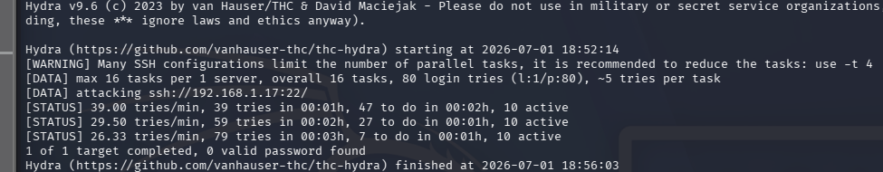
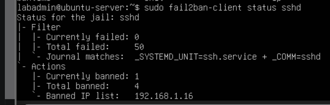
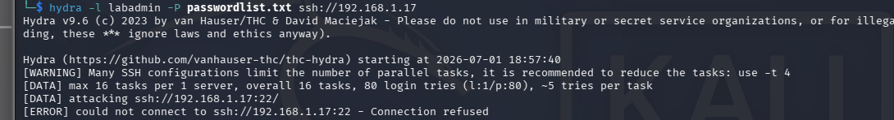
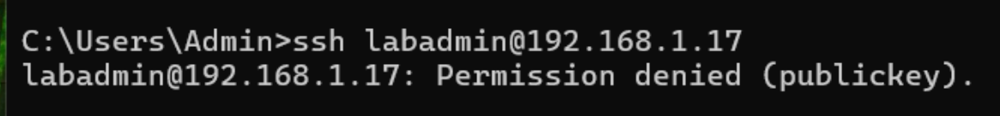
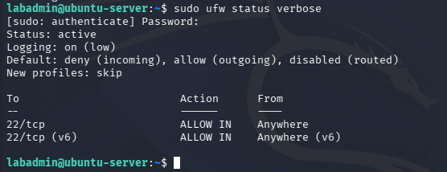

# SSH Hardening with key-based authentication

The purpose of this lab project is to reinforce the Ubuntu Server VM by enabling key-pair authentication. Key-pair authentication is a login method that does not require a password and instead, relies on a mathematical function to ensure user confidentiality and integrity. This authentication method protects the server from brute-force login attacks. In this project, Kali Linux will be used to conduct a brute force attack before and after SSH hardening to showcase the difference in security. 

As such, in order to reinforce the Ubuntu VM these actions could be taken:
| Action | Reason |
|------|---------------|
| Create Non-root sudo user| Creating a sudo user to login to for root access allows for better tracking and accountability since root logins are anonymous.|
| Use fail2ban| This is an intrusion prevention software tool that allows for monitoring of system logs. It can detect threats and respond by banning the IP address of the threat actor |
| Switch to SSH key auth| Key-pair authentication is especially strong and practically impossible to brute-force. A public key sits on the server, a private key sits on user machines, a mathematical function is used to check to authenticate the key-pair. |
| Harden sshd_config| Disabling root login and password authentication ensures that the previous steps are the only way to gain access to sudo access and user access. |
| Default-deny firewall | Default-deny is the cybersecurity framework and the most common firewall configuration. The firewall denies all network traffic unless explicitly allowed. This ensures that all allowed traffic is explicitly tracked and known. |


## Software/Tools Used
Kali Linux:
- hydra
- nmap

Ubuntu Server:
- fail2ban

## Create Sudo User
```bash
sudo adduser labadmin # creates a user called labadmin
sudo usermod -aG sudo labadmin # adds labadmin to sudo group
```
## Hydra Brute-force
This step uses hydra, an open source logon cracker, and in this project, it is used to brute-force through labadmin. *DISCLAIMER, this only simulates how a brute-force attack at the simplest level. *
```zsh
hydra -l labadmin -P passwordlist.txt ssh://192.168.1.17
```
Result:



## Fail2Ban setup
```bash
sudo apt install fail2ban
sudo nano /etc/fail2ban/jail.local
```
Apply the config:
```bash
sudo systemctl restart fail2ban
```
```
[sshd]
enabled = true
maxretry = 5
bantime = 600
```
Proof:
```zsh
hydra -l labadmin -P passwordlist.txt ssh://192.168.1.17
```


Hydra was used once again, with 80+ password entries. Hydra was unsuccessful in finding a match even though it should have due to fail2ban.
```bash
sudo fail2ban-client status sshd
```


According to fail2ban logs, the Kali VM's ip was banned.



Hence when we try hydra once more, connection was refused.

## Generate key-pair authentication key
In the Kali Linux VM:
```zsh
ssh-keygen -t ed25519 # Generates key
ssh-copy-id labadmin@192.168.1.17 # Sends key to labadmin
ssh labadmin@192.168.1.17 # Login to labadmin to test if key pairing worked
```

## Disable password auth and root user login
```bash
sudo nano /etc/ssh/sshd_config
```
```
PermitRootLogin no
PasswordAuthentication no
```
```bash
sudo systemctl reload ssh
```

Result:



## Firewall Configuration
```bash
sudo ufw default deny incoming
sudo ufw default allow outgoing
sudo ufw allow 22/tcp
sudo ufw enable
```

Check:




## Conclusion
Key-Pair authentication is much more secure than password login since it is practically immune to brute-force attacks. In this project, hydra was used to brute-force the non-root sudo user, labadmin, in which the password was compromised. After installing fail2ban and enabling a max password retry number of 5, fail2ban was able to prevent further brute-force attacks and banned Kali VM's ip address. After this, password authentication and root login was disabled entirely to further lock down the Ubuntu server. In doing so, it denies all devices that does not have a private key that matches with a stored public key from Ubuntu. Moreover, the firewall was configured to be default deny which denies all network traffic by default, only allowing explicit traffic that was configured to be allowed. Now, port 22 is the only port open. Overall, key cybersecurity and networking concepts were shown in this lab project. 

- Basic Firewall configuration (default deny using ufw)
- Blue team: Intrusion Prevention Systems proficicency (the use of fail2ban)
- Red team: Brute-force password attack familiarity (the use of hydra)
- Key-pair authentication familiarity
- Using a sudo user to track all user activity for root activity
- General SSH hardening (disabling password auth and root login)
- Intermediate Linux familiarity (User Permission Management)


## Next Step
The next lab project could tackle more on firewalls using iptables instead of ufw, and using the nmap tool to scan for open ports. 